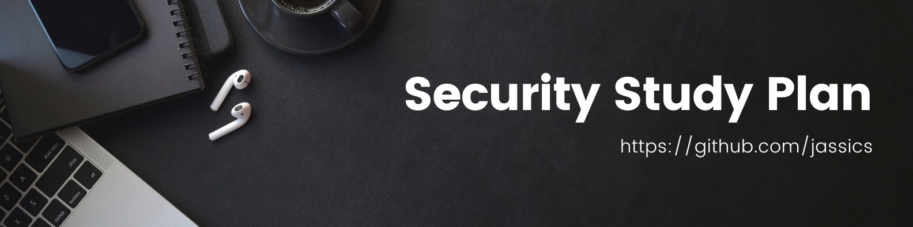

A Practical Study Plan to become a successful cybersecurity engineer based on roles like Pentest, AppSec, Cloud Security, DevSecOps, and so on with free/paid resources, tools, and concepts to excel.

**It will cover but not limited to:**

**_Done_**
1. [Common Skills for Security Study Plan](common-skills-study-plan.md)
2. [AWS Security Study Plan](aws-security-study-plan.md)
3. [GCP Security Study Plan](gcp-security-study-plan.md)
4. [Web Penetration Testing Study Plan](web-pentest-study-plan.md)
5. [Application Security Testing Plan](application-security-study-plan.md)
6. [API Security Study Plan](api-security-study-plan.md)

**_ToDo_**
1. [Azure Security Study Plan](azure-security-study-plan.md)
2. [DevSecOps Study Plan](devsecops-study-plan.md) - _In Progress_
3. [Docker Security Study Plan](docker-security-study-plan.md)
4. [Kubernetes Security Study Plan](kubernetes-security-study-plan.md)
5. [GRC Study Plan](grc-study-plan.md)
6. [Network Security Study Plan](network-security-study-plan.md)
7. [Cryptography Study Plan](cryptography-study-plan.md)
8. [Threat Modeling Study Plan](threat-modeling-study-plan.md)
9. [Software Supply Chain Security Study Plan](software-supply-chain-security-study-plan.md)
10. [Secure Code Review Study Plan](secure-code-review-study-plan.md)
11. [Secure Software Development Lifecycle Study Plan](secure-software-development-lifecycle-study-plan.md)
12. [Security Architecture Study Plan](security-architecture-study-plan.md)

I got the idea of creating this repo after seeing [coding-interview-security](https://github.com/jwasham/coding-interview-university) as it echoes the journey that I went through to get into the full-time security role.

>I created this study plan to help people who are looking for guidance and help to plan and prepare for a job-specific skill set.
If you study 3-4 hours per day for the next 6 months, you can clear high rewarding jobs provided you do lots of hands-on and go through each necessary topic/concept more than thrice and you are from a tech background. This worked in my case.
>
>Please note that some topics would be common for any listed security roles. Check [common-skills-study-plan](common-skills-study-plan.md)
>
>I will try my level best to add study references from the beginners' perspective but will have even advanced level coverage too.
>
>All the best for your security journey!

## What is it?
This is to give a study plan to prepare for a specific role. It is of course multiple months of hard work and dedication which need a proper roadmap. 
Hence, this repo would be a point source for all your study plans.

**Prerequisites:**
- Ready to devote time daily
- from a tech background, it can take a little more time but still possible to make a career in cybersecurity.
- Never give up attitude
- Hacker Mindset
- Ready to explore on your own

**Please note** that there are many job titles under each of these study plans, but I am keeping a generic study plan so that you can tick out whichever you already know. This way you would know how much you know and how much you still need to learn to grow up the ladder.

Check out the YouTube video on ["Cybersecurity Roadmap for Beginners"](https://www.youtube.com/watch?v=-qklv1WXdmo) and ["How to make a career in Cybersecurity"](https://www.youtube.com/watch?v=TPoI1vwcdxo&list=PLRTsCutScZnzN66sG_X9GyJFt-kkKoksi&index=5).
Then, you will have a better idea of why to use it and how to use this study plan for your preparation.

## Why use it?
If you want to work as a security engineer, these are the skills/topics/concepts you need to know and learn thoroughly..

When I started learning security concepts, everything was new to me, and I wasted lots of time on Google searches, YouTube videos, articles, etc. to figure out what was required and what was not.
I am still learning as cybersecurity is evolving, so we must. My target is to keep this repo up to date, of course with the help of wonderful learners like you.

It takes time to be confident in some skills, treat it as a long plan. It may take months or sometimes a year too, but keep yourself motivated and don't stop learning. 
However, If you are familiar with a lot of topics already it will take less time for you.

## How to use it?
Everything below is like an outline, and you can tick out the items that you have already covered or know in order from top to bottom.

I'm using [GitHub's special markdown flavor](https://guides.github.com/features/mastering-markdown/#GitHub-flavored-markdown), including task lists to track progress.
As a Cybersecurity professional, I would [recommend you to learn git](https://www.udemy.com/course/git-basics-for-everyone) and clone this repo for your learning purposes.

## Update your resume
Before updating or creating a resume for a job, please check:
1. What job title you are trying for?
2. Do you fall in that experience range?
3. Check what skills it is looking for.
4. Check for job location or is it remote(work from home/anywhere)?

Now, prepare the resume based on the above info and your skill sets. Try to be honest here.
See, if you can finish your resume in 1-2 pages. Check the 1-page resume below links:
1. [One page resume template from zety.com](https://zety.com/blog/one-page-resume-templates)
2. [Easy Resume](https://www.easyresume.io/)
3. [Various Security Resume sample from qwikresume.com](https://www.qwikresume.com/resume-samples/security-engineer/)
4. [How To Write a Security Engineer Resume (With Example)](https://www.indeed.com/career-advice/resumes-cover-letters/security-engineer-resume)
5. [Network Security Engineer Sample](https://enhancv.com/resume-examples/network-security-engineer/)
6. [Cloud Security Engineer Resume](https://www.hireitpeople.com/resume-database/68-network-and-systems-administrators-resumes/138883-cloud-security-engineer-resume)
7. [AWS Security Engineer Resume](https://www.livecareer.com/resume-search/r/aws-solutions-architect-cloud-security-engineer-dfe9b3bd87d04311bcb32119da547271)
8. [Lead DevSecOps Resume Example](https://www.livecareer.com/resume-search/r/lead-devsecops-engineer-53a226a3bebc4987af0dea7ce0c6740b)
9. [Sr. DevSecOps Engineer Resume Example](https://www.livecareer.com/resume-search/r/sr-devsecops-engineer-81ad059140cf43fda69e77d614d65685)
10. [Penetration Tester Consultant Resume Sample](https://www.livecareer.com/resume-search/r/penetration-tester-consultant-25926a15cbac482883f8d00d26da0d86)

## Finding the right job
You might see hundreds of job openings, some may be from your dream company. But, once you closely look it doesn't match with your skills. It seems the job title was a little misleading and more of a generic description. Security researchers or security analysts are just a few examples.
So, finetune and narrow down the job search with the below websites but not limited to:
1. Which job title you are targeting?
2. What skills do you have vs what skills JD requires?
3. Years of experience (range) is matching?

Now search or subscribe to below job portal below:
1. Linkedin. Yes, nowadays it's job alert setting does a better job in finding the right job for you.
2. Naukri.com (Mostly in Asian countries)
3. indeed.com
4. monster.com
5. instahyre.com
6. cutshort.io
7. [Null Jobs Community](https://jobs.null.community/)
8. [Cybersecurity Jobs](https://www.cybersecurityjobs.com/)
9. [Interactive way to find jobs, skills, salary, etc.](https://www.cyberseek.org/pathway.html)

## Interview Preparation
You can start preparing for the job interview once you have solid knowledge as per the checklist for the given role(s). There are a few common security questions that you should have a look at:
1. [Cybersecurity Interview Questions and Answers - Youtube](https://www.youtube.com/watch?v=q5pQ_YtJWpA)
2. [Cybersecurity Questions and Answers by Springboard](https://www.springboard.com/blog/cybersecurity/25-cybersecurity-job-interview-questions-and-answers/)
3. [Cybersecurity Questions and Answers form indeed](https://in.indeed.com/career-advice/interviewing/cyber-security-interview-questions)
4. [100+ Q&A for Cybersecurity domain from guru99](https://www.guru99.com/cyber-security-interview-questions.html)

### Common Interview Questions
* How do you keep updated yourself in the security domain?
* What would you do typically on the first day of your job? 
* What personal achievement are you most proud of?
* What was your last tough vulnerability that you found?
* Why should we hire you?
* What did you learn in the last 6 months and how was it relevant to your career/project?
* Where do you see after 5 years of working with this organization?

You can check [some common answers from here](https://ayedot.com/119/MiniBlog/General-Interview-Questions-and-their-Answers-for-Tech-Jobs)

## Let's contribute and grow this repo together
**Want to contribute? Please [fork the repo](https://github.com/jassics/security-study-plan/fork) and [send PR for review](https://github.com/jassics/security-study-plan/pulls)**
