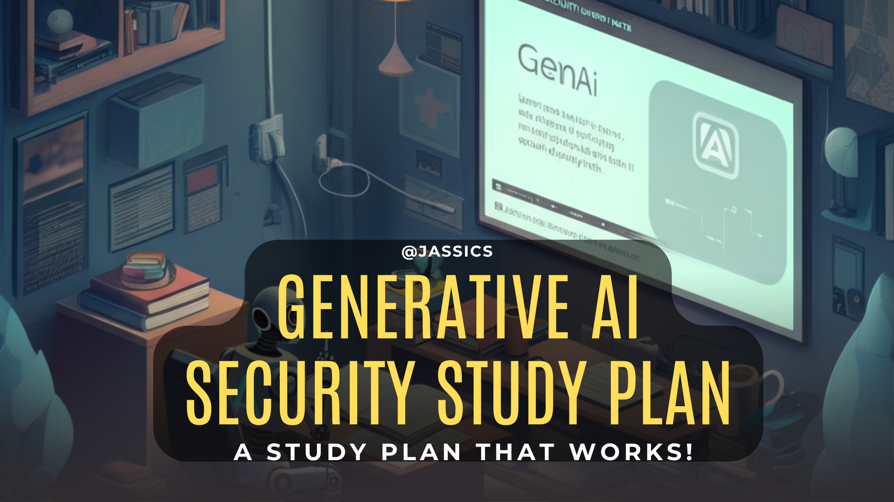

# GenAI Security Study Plan (GenAI/LLM)

This study plan covers all the topics, concepts, blogs, videos, books, videos, newsletters etc. by keeping GenAI security in mind.

It should take 6-9 months to be good at GenAI security so that you can do one or more of the below listed things:
1. LLM pentesting
2. GenAI security assessment
3. Design and implement secure GenAI/LLM architectures for organizations.
4. Understanding of GenAI from GRC perspective
5. Knowledge of different GenAI security frameworks
6. AI enabled Threat Modeling or Threat Modeling of AI systems
7. Good grip on LLM safety, LLM Guardrails, Responsible AI, AI ethic etc.

It would help you in your current work as well as finding a new work using GenAI security skills.

Note: I am not writing anything that would require core AI/ML skills. It's all are done after keeping security focus in mind.

> [!IMPORTANT]  
> This field is still evolving, so our repo would too! Stay tuned!

## Organizational Capabilities that you can be job ready after going through mentioned study plan

### Security Assessments & Audits
- Conduct comprehensive GenAI security assessments using [OWASP LLM Top 10 framework](https://genai.owasp.org/)
- Perform LLM application penetration testing and vulnerability assessments
- Audit RAG (Retrieval Augmented Generation) implementations for security risks
- Evaluate prompt injection and jailbreaking vulnerabilities
- Assess model security, including adversarial attacks and data poisoning risks
- Review AI/ML supply chain security (model provenance, dependencies, third-party APIs)

### Governance, Risk & Compliance (GRC)
- Develop GenAI security policies and procedures aligned with [NIST AI RMF](https://nvlpubs.nist.gov/nistpubs/ai/NIST.AI.600-1.pdf)
- Create AI governance frameworks and risk management strategies
- Implement compliance controls for AI regulations ([EU AI Act](https://eur-lex.europa.eu/legal-content/EN/ALL/?uri=CELEX%3A32021R0215), etc.)
- Establish AI ethics and responsible AI practices
- Design AI security awareness training programs for employees
- Create incident response plans specifically for AI/ML security incidents

### Architecture & Implementation
- Design secure AI/ML pipelines and infrastructure
- Implement secure GenAI architectures (secure RAG, fine-tuning, inference)
- Deploy AI security tools (LLM Guard, model scanning, prompt filtering)
- Establish secure model deployment and MLOps practices
- Design data privacy controls for AI training and inference data
- Implement monitoring and logging for AI systems

### Risk Management & Threat Modeling
- Conduct [AI/ML specific threat modeling exercises](https://www.matillion.com/blog/ai-threat-modeling)
- Assess business risks associated with GenAI implementations
- Develop risk mitigation strategies for AI adoption
- Create AI security metrics and KPIs for organizational reporting
- Establish AI risk registers and continuous monitoring processes

### Security Engineering & DevSecOps
- Integrate AI security into CI/CD pipelines
- Implement security testing for AI/ML models and applications
- Design secure model training environments and data handling processes
- Establish model version control and security scanning practices
- Create automated security testing for prompt injection and other LLM vulnerabilities

### Incident Response & Forensics
- Investigate AI/ML security incidents and breaches
- Develop playbooks for AI-specific security incidents
- Perform forensic analysis on compromised AI systems
- Create incident classification systems for AI/ML security events

### Consulting & Advisory Services
- Provide GenAI security consulting to organizations
- Conduct security reviews of vendor AI solutions
- Advise on secure AI procurement and third-party risk management
- Lead AI security transformation initiatives
- Mentor and train internal security teams on AI security

> [!NOTE]  
> ToC will highlight GenAI based concepts and learning reqources as and when we come across some awesome learning materials. 

## Study Plan ToC:
1. [GenAI/LLM fundamentals Concepts](#genai-fundamental-concepts) - 4 weeks
2. [Prompt Engineering](#prompt-engineering) - 1 week
3. [RAG](#rag) - 1-2 weeks
4. [Fine Tuning](#fine-tuning) - 2 weeks
5. [AI Agents)](#ai-agents) - 1 week
6. [Agentic AI](#agentic-ai) - 1 week
7. [MCP](#mcp) - 1 week
8. [Certifications](#certifications) - on your bandwidth and wish
9. [GenAI Interview Questions](#genai-interview-questions)
10. [GenAI Security Tools](#genai-security-tools)

---
## Note: I will add the format and categories later. It's just a placeholder for now.

1. LLM CS-324 from Stanford University: https://stanford-cs324.github.io/winter2022/ 
2. COS 597G (Fall 2022): Understanding Large Language Models from Princeton University: https://www.cs.princeton.edu/courses/archive/fall22/cos597G/ 
3. Intro to LLM Security from WhyLabs (Youtube): https://www.youtube.com/watch?v=dj1H4g4YSlU
4. GenAI with LLM from Coursera: https://www.coursera.org/learn/generative-ai-with-llms#modules 
5. LLM Security: https://llmsecurity.net/
6. LLM AI Security and Governance Checklist from OWASP: https://owasp.org/www-project-top-10-for-large-language-model-applications/llm-top-10-governance-doc/LLM_AI_Security_and_Governance_Checklist.pdf
7. OWASP Top 10 for LLM Application: https://owasp.org/www-project-top-10-for-large-language-model-applications/assets/PDF/OWASP-Top-10-for-LLMs-2023-v1_1.pdf 
8. Web LLM attacks from portswigger: https://portswigger.net/web-security/llm-attacks 
9. LLM Pentesting exam: https://secops.group/product/certified-ai-ml-pentester/
10. Prompt injection jailbreaking: https://ogre51.medium.com/security-of-llm-apps-prompt-injection-jailbreaking-fb9fc5c883a8 
11. AI security challenges, CTF style: https://promptairlines.com/
12. Play another LLM security challenge with Gandalf: https://gandalf.lakera.ai/ 
13. Riding the RAG Trail: Access, Permissions and Context: https://www.lasso.security/blog/riding-the-rag-trail-access-permissions-and-context
14. Securing Risks with RAG Architectures: https://ironcorelabs.com/security-risks-rag/
15. Secure your RAG: https://ironcorelabs.com/security-risks-rag/ 
16. Mitigating Security Risks in Retrieval Augmented Generation (RAG) LLM Applications: https://cloudsecurityalliance.org/blog/2023/11/22/mitigating-security-risks-in-retrieval-augmented-generation-rag-llm-applications# 
17. RAG: The Essential Guide: https://www.nightfall.ai/ai-security-101/retrieval-augmented-generation-rag 
18. Why RAG is revolutionising GenAI: https://www.immuta.com/guides/data-security-101/retrieval-augmented-generation-rag/ 
19. PortSwigger LLM attacks: https://portswigger.net/web-security/llm-attacks
20. LLM Security portal: https://llmsecurity.net/
21. What are foundational models: https://www.datacamp.com/blog/what-are-foundation-models 
22. World’s first bug bounty platform for AI/ML: https://huntr.com/
23. Protect AI's OSS portfolio includes tools aimed at improving the security of AI/ML software: https://github.com/protectai
    1. LLM Guard: https://github.com/protectai/llm-guard 
    2. AI/ML exploits: https://github.com/protectai/ai-exploits 
    3. Model scan: https://github.com/protectai/modelscan 
    4. rebuff: https://github.com/protectai/rebuff 
    5. NB Defense: https://github.com/protectai/nbdefense 
24. Safeguarding LLm with llm-guard: https://medium.com/@dataenthusiast.io/language-models-at-risk-safeguarding-ai-with-llm-guard-11a3e7923af5
25. LLM Guard Playground: https://huggingface.co/spaces/protectai/llm-guard-playground
26. Courses:
    1. https://www.coursera.org/learn/generative-ai-with-llms (by DeepLearning and AWS)
    2. https://www.coursera.org/specializations/generative-ai-engineering-with-llms#courses
    3. https://www.coursera.org/specializations/generative-ai-for-cybersecurity-professionals (Specialization from IBM [3 courses])
    4. https://www.coursera.org/specializations/ai-for-cybersecurity (Specialisation from John Hopkins University)
27. NIST AI RMF Playbook: https://airc.nist.gov/AI_RMF_Knowledge_Base/Playbook
28. AI RMF: https://nvlpubs.nist.gov/nistpubs/ai/NIST.AI.600-1.pdf
29. Adversarial Machine Learning: https://nvlpubs.nist.gov/nistpubs/ai/NIST.AI.100-2e2023.pdf
30. Failure Models in Machine Learning:https://securityandtechnology.org/wp-content/uploads/2020/07/failure_modes_in_machine_learning.pdf 
31. A quick check on the AI Threat Model: https://plot4.ai/assessments/quick-check
32. Threat Modeling AI/ML by Microsoft: https://learn.microsoft.com/en-us/security/engineering/threat-modeling-aiml
33. Security Incident Response using LLM: https://engineering.mercari.com/en/blog/entry/20241206-streamlining-security-incident-response-with-automation-and-large-language-models/  
34. The foundation of AI Security by AttackIQ: https://www.academy.attackiq.com/courses/foundations-of-ai-security
