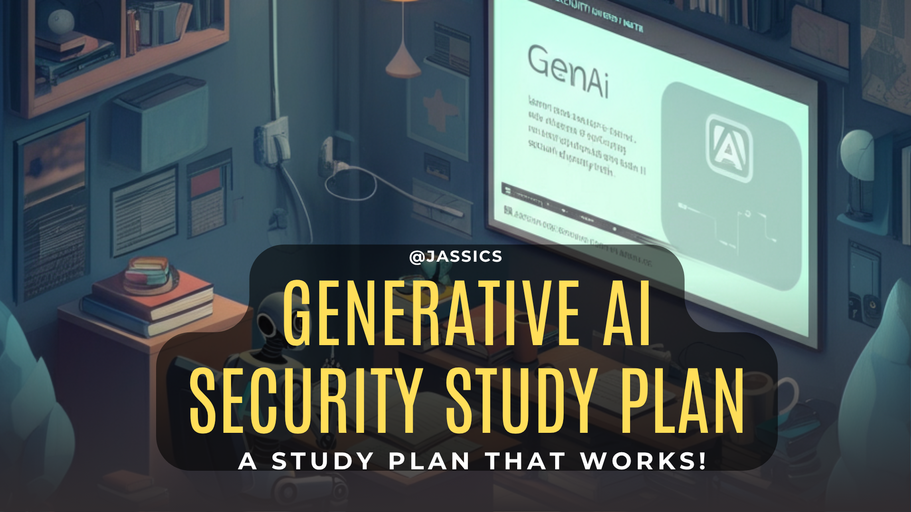

# GenAI Security Study Plan (GenAI/LLM)

This study plan covers all the topics, concepts, blogs, videos, books, videos, newsletters etc. by keeping GenAI security in mind.

It should take 6-9 months to be good at GenAI security so that you can do one or more of the below listed things:
1. LLM pentesting
2. GenAI security assessment
3. Design and implement secure GenAI/LLM architectures for organizations.
4. Understanding of GenAI from GRC perspective
5. Knowledge of different GenAI security frameworks
6. AI enabled Threat Modeling or Threat Modeling of AI systems
7. Good grip on LLM safety, LLM Guardrails, Responsible AI, AI ethic etc.

It would help you in your current work as well as finding a new work using GenAI security skills.

Note: I am not writing anything that would require core AI/ML skills. It's all are done after keeping security focus in mind.

> [!IMPORTANT]  
> This field is still evolving, so our repo would too! Stay tuned!

## Organizational Capabilities that you can be job ready after going through mentioned study plan

### Security Assessments & Audits
- Conduct comprehensive GenAI security assessments using the [OWASP Top 10 for LLM Applications 2026](https://genai.owasp.org/resource/owasp-genai-llm-top-10-2026/) and the [OWASP Top 10 for Agentic Applications 2026](https://genai.owasp.org/resource/owasp-top-10-for-agentic-applications-for-2026/)
- Perform LLM application penetration testing and vulnerability assessments
- Score agentic AI findings with [OWASP AIVSS](https://aivss.owasp.org/) instead of forcing them into plain CVSS
- Audit RAG (Retrieval Augmented Generation) implementations for security risks
- Evaluate prompt injection and jailbreaking vulnerabilities
- Assess model security, including adversarial attacks and data poisoning risks
- Review AI/ML supply chain security (model provenance, dependencies, third-party APIs)

### Governance, Risk & Compliance (GRC)
- Develop GenAI security policies and procedures aligned with [NIST AI RMF](https://nvlpubs.nist.gov/nistpubs/ai/NIST.AI.600-1.pdf) and [ISO/IEC 42001:2023 (AIMS)](https://www.iso.org/standard/42001)
- Create AI governance frameworks and risk management strategies
- Implement compliance controls for AI regulations ([EU AI Act (Regulation (EU) 2024/1689)](https://eur-lex.europa.eu/eli/reg/2024/1689/oj), [India AI Governance Guidelines](https://indiaai.gov.in/), etc.) — note the [Digital Omnibus](https://digital-strategy.ec.europa.eu/) (agreed May-Jun 2026) pushed most high-risk (Annex III) obligations to Dec 2027 and Annex I to Aug 2028; only Article 50 transparency duties and GPAI enforcement land Aug 2026
- Establish AI ethics and responsible AI practices
- Design AI security awareness training programs for employees
- Create incident response plans specifically for AI/ML security incidents

### Architecture & Implementation
- Design secure AI/ML pipelines and infrastructure
- Implement secure GenAI architectures (secure RAG, fine-tuning, inference)
- Deploy AI security tools (LLM Guard, model scanning, prompt filtering)
- Establish secure model deployment and MLOps practices
- Design data privacy controls for AI training and inference data
- Implement monitoring and logging for AI systems

### Risk Management & Threat Modeling
- Conduct [AI/ML specific threat modeling exercises](https://www.matillion.com/blog/ai-threat-modeling)
- Assess business risks associated with GenAI implementations
- Develop risk mitigation strategies for AI adoption
- Create AI security metrics and KPIs for organizational reporting
- Establish AI risk registers and continuous monitoring processes

### Security Engineering & DevSecOps
- Integrate AI security into CI/CD pipelines
- Implement security testing for AI/ML models and applications
- Design secure model training environments and data handling processes
- Establish model version control and security scanning practices
- Create automated security testing for prompt injection and other LLM vulnerabilities

### Incident Response & Forensics
- Investigate AI/ML security incidents and breaches, using the [OWASP GenAI Incident Response Guide v1.0](https://genai.owasp.org/resource/genai-incident-response-guide-1-0/) as the reference framework
- Tell an *AI* incident apart from an ordinary cyber incident — the guide gives diagnostic criteria by AI stack layer and a quick-reference table (OWASP GenAI Incident Response Guide v1.0)
- Develop playbooks for AI-specific security incidents (attacks on AI systems, on AI supply chains, and on third-party model providers)
- Build an AI asset inventory and stakeholder map *before* an incident, and pay particular attention to non-human identities (OWASP GenAI Incident Response Guide v1.0)
- Perform forensic analysis on compromised AI systems
- Create incident classification systems for AI/ML security events, including an AI incident severity matrix and a defined blast radius per incident
- Learn from the guide's worked vignettes: Air Canada chatbot, Microsoft Tay, the "EchoLeak" Microsoft Copilot exploit, MathGPT code execution, and the ChatGPT "Operator" agent data leak

### Consulting & Advisory Services
- Provide GenAI security consulting to organizations
- Conduct security reviews of vendor AI solutions
- Advise on secure AI procurement and third-party risk management
- Lead AI security transformation initiatives
- Mentor and train internal security teams on AI security

> [!NOTE]  
> ToC will highlight GenAI based concepts and learning reqources as and when we come across some awesome learning materials. 

## Study Plan ToC:
1. [GenAI/LLM Fundamental Concepts](#genai-fundamental-concepts) - 4 weeks
2. [Prompt Engineering](#prompt-engineering) - 1 week
3. [RAG (Retrieval Augmented Generation)](#rag) - 1-2 weeks
4. [Fine Tuning](#fine-tuning) - 2 weeks
5. [AI Agents](#ai-agents) - 1 week
6. [Agentic AI](#agentic-ai) - 1 week
7. [MCP (Model Context Protocol)](#mcp) - 1 week
8. [GenAI for the Security Engineer](#genai-for-the-security-engineer) - 1 week
9. [Certifications](#certifications) - on your bandwidth and wish
10. [GenAI Interview Questions](#genai-interview-questions)
11. [GenAI Security Tools](#genai-security-tools)

---

## GenAI Fundamental Concepts
**Duration: 4 weeks**

### Week 1: AI/ML Foundations & LLM Basics
- [ ] **Understanding AI vs ML vs Deep Learning vs GenAI**
  - [What are Foundation Models](https://www.datacamp.com/blog/what-are-foundation-models)
  - [Introduction to Large Language Models](https://www.coursera.org/learn/generative-ai-with-llms)
  - [Transformer Architecture Explained](https://jalammar.github.io/illustrated-transformer/)

- [ ] **LLM Architecture & Components**
  - Attention mechanisms and self-attention
  - Encoder-decoder architecture
  - Pre-training vs fine-tuning concepts
  - Token embeddings and positional encoding

- [ ] **Popular LLM Models**
  - GPT family (GPT-3.5, GPT-4, GPT-4o)
  - Claude (Anthropic)
  - Llama 2/3 (Meta)
  - Gemini (Google)
  - Open-source vs proprietary models

### Week 2: LLM Security Fundamentals
- [ ] **OWASP Top 10 for LLM Applications 2026 (current list — start here)**
  - [OWASP Top 10 for LLM Applications 2026 (v2026, August 2026)](https://genai.owasp.org/resource/owasp-genai-llm-top-10-2026/)
  - LLM01:2026 Prompt Injection
  - LLM02:2026 Sensitive Information Disclosure
  - LLM03:2026 Excessive Agency
  - LLM04:2026 Supply Chain
  - LLM05:2026 Data and Model Poisoning
  - LLM06:2026 Unbounded Consumption
  - LLM07:2026 Misinformation
  - LLM08:2026 Hidden Context Exposure *(re-scoped from 2025's "System Prompt Leakage")*
  - LLM09:2026 Vector and Embedding Weaknesses
  - LLM10:2026 Improper Output Handling
  - Note: the 2026 list is the first to validate the practitioner vote against a corpus of real incidents (7,714 collected, 6,639 classified), and its Appendix A maps every entry to MITRE ATLAS, ATT&CK, CWE, NIST AI 600-1 and OWASP AIVSS (OWASP Top 10 for LLM Applications 2026)

- [ ] **How the list evolved (useful for interviews and for reading older reports)**
  - [OWASP Top 10 for LLM Applications 2023 v1.1 (historical)](https://owasp.org/www-project-top-10-for-large-language-model-applications/assets/PDF/OWASP-Top-10-for-LLMs-2023-v1_1.pdf)
  - Track what moved: Excessive Agency and Unbounded Consumption escalated in 2026; Supply Chain, Data & Model Poisoning and Improper Output Handling were deprioritized (OWASP Top 10 for LLM Applications 2026)
  - Retired/renamed entries you will still see in the wild: Insecure Plugin Design, Model Denial of Service, Overreliance, Model Theft, System Prompt Leakage

- [ ] **Common Attack Vectors**
  - [Prompt Injection and Jailbreaking](https://ogre51.medium.com/security-of-llm-apps-prompt-injection-jailbreaking-fb9fc5c883a8)
  - Data poisoning attacks
  - Model extraction and theft
  - Adversarial examples
  - Membership inference attacks
  - Hidden context exposure (system prompts, tool definitions, retrieved context leaking to users)

- [ ] **GenAI Data Security (data-layer risks, separate from model-layer risks)**
  - [OWASP GenAI Data Security: Risks and Mitigations 2026 (v1.0, March 2026)](https://genai.owasp.org/resource/owasp-genai-data-security-risks-mitigations-2026/) — 21 risks, DSGAI01-DSGAI21
  - Worth memorising the high-frequency ones: DSGAI01 Sensitive Data Leakage, DSGAI02 Agent Identity & Credential Exposure, DSGAI03 Shadow AI & Unsanctioned Data Flows, DSGAI13 Vector Store Platform Data Security
  - AI-DSPM (Data Security Posture Management for GenAI) as an emerging control area (OWASP GenAI Data Security 2026)
  - [LLM and GenAI Data Security Best Practices 2025 (OWASP GenAI Security Project)](https://genai.owasp.org/resources/)

### Week 3: AI Governance & Compliance
- [ ] **Regulatory Frameworks & Standards**
  - [NIST AI 600-1: Generative AI Profile (AI RMF companion)](https://nvlpubs.nist.gov/nistpubs/ai/NIST.AI.600-1.pdf)
  - [NIST AI RMF Playbook](https://airc.nist.gov/AI_RMF_Knowledge_Base/Playbook)
  - [EU AI Act (Regulation (EU) 2024/1689)](https://eur-lex.europa.eu/eli/reg/2024/1689/oj) — full high-risk (Annex III) obligations were pushed to Dec 2027 and Annex I to Aug 2028 by the 2026 Digital Omnibus; only Article 50 transparency duties and GPAI enforcement land Aug 2026 as originally scheduled
  - [ISO/IEC 42001:2023 — Artificial Intelligence Management System (AIMS)](https://www.iso.org/standard/42001) — the world's first AI management-system standard (released Dec 2023). It is a *management system* standard, not a technical spec: 10 clauses plus annexes, audited per ISO 19011, and the natural certification target if your org wants an auditable AI governance posture (ISO/IEC 42001:2023 AIMS Internal Auditor course outline)
  - ISO/IEC 23053:2022 (AI/ML system framework)
  - [India AI Governance Guidelines (MeitY, Government of India)](https://indiaai.gov.in/) — India's national framework, built on seven "sutras" (Trust, People First, Innovation over Restraint, Fairness & Equity, Accountability, Understandable by Design, Safety/Resilience/Sustainability) and six pillars across enablement, regulation and oversight; techno-legal and voluntary-measure led rather than prescriptive (India AI Governance Guidelines)

- [ ] **Implementation Frameworks (turning governance into controls)**
  - [Databricks AI Security Framework (DASF) v2.0](https://www.databricks.com/resources/whitepaper/databricks-ai-security-framework-dasf) — maps risks across 12 AI system components (raw data → data prep → datasets → catalog governance → algorithms → evaluation → models → model management → serving/inference request & response → MLOps → platform security) to concrete mitigation controls; useful when you need a control list, not just a risk list. DASF 2.0 enumerates 62 technical risks against 64 recommended controls (Databricks AI Security Framework v2.0); Databricks has since published [DASF v3.0 adding agentic AI risks and controls](https://www.databricks.com/blog/agentic-ai-security-new-risks-and-controls-databricks-ai-security-framework-dasf-v30)
  - [OWASP LLM AI Security & Governance Checklist v1.1](https://genai.owasp.org/resources/)

- [ ] **AI Ethics & Responsible AI**
  - Bias and fairness in AI systems
  - Transparency and explainability
  - Privacy and data protection
  - Accountability and human oversight

### Week 4: Threat Modeling & Risk Assessment
- [ ] **AI-Specific Threat Modeling**
  - [Microsoft's AI/ML Threat Modeling](https://learn.microsoft.com/en-us/security/engineering/threat-modeling-aiml)
  - [AI Threat Modeling by Matillion](https://www.matillion.com/blog/ai-threat-modeling)
  - [Quick AI Threat Model Check](https://plot4.ai/assessments/quick-check)
  - [OWASP Agentic AI — Threats and Mitigations (v1.0, Feb 2025)](https://genai.owasp.org/resource/agentic-ai-threats-and-mitigations/) — reference agentic architecture used as the canvas for threat models, a structured Agentic Threat Taxonomy Navigator, and four worked example threat models (Agentic AI Threats and Mitigations v1.0)

- [ ] **Risk Assessment & Scoring Frameworks**
  - [NIST AI 100-2e2025: Adversarial Machine Learning — A Taxonomy and Terminology of Attacks and Mitigations (March 2025)](https://csrc.nist.gov/pubs/ai/100/2/e2025/final) — current edition; supersedes the 2023 e2023 edition and now includes contributions from the US AI Safety Institute and UK AI Security Institute (NIST AI 100-2e2025)
  - [NIST AI 100-2e2023 (previous edition, for reference)](https://nvlpubs.nist.gov/nistpubs/ai/NIST.AI.100-2e2023.pdf)
  - [OWASP AIVSS — AI Vulnerability Scoring System (v0.8)](https://aivss.owasp.org/) — agentic AI's answer to CVSS. It keeps a CVSS v4.0 base score and layers an Agentic AI Risk Score (AARS) built from 10 agentic risk amplification factors plus a threat multiplier and mitigation factor, so an "excessive agency" issue no longer gets scored like a static web bug. Ships a JSON report schema and maps to the OWASP Agentic AI Top 10 and CSA MAESTRO layers (AIVSS Scoring System for OWASP Agentic AI Core Security Risks v0.8)
  - [Failure Modes in Machine Learning](https://securityandtechnology.org/wp-content/uploads/2020/07/failure_modes_in_machine_learning.pdf)
  - Business impact assessment for AI systems

**Hands-on Practice:**
- [ ] Complete [Gandalf LLM Security Challenge](https://gandalf.lakera.ai/)
- [ ] Try [Prompt Airlines CTF](https://promptairlines.com/)
- [ ] Practice with [LLM Security Portal](https://llmsecurity.net/)
- [ ] Work through the [OWASP GenAI Red Teaming Guide v1.0](https://genai.owasp.org/initiatives/genai-red-teaming-initiative/) blueprint — it splits red teaming into four evaluation phases (model, implementation, system, and runtime/human & agentic), each with its own checklist, plus appendices on metrics, tools/datasets, continuous monitoring, and agentic red-teaming tasks (GenAI Red Teaming Guide v1.0)
- [ ] Score one finding yourself with the [AIVSS calculator](https://aivss.owasp.org/) and compare it to a plain CVSS v4.0 score

---

## Prompt Engineering
**Duration: 1 week**

### Understanding Prompt Engineering
- [ ] **Prompt Engineering Fundamentals**
  - What is prompt engineering and why it matters for security
  - Types of prompts: zero-shot, few-shot, chain-of-thought
  - Prompt structure and best practices
  - Context window limitations and management

- [ ] **Security-Focused Prompt Engineering**
  - Defensive prompt engineering techniques
  - Input validation through prompts
  - Output sanitization strategies
  - Prompt injection prevention techniques

### Advanced Prompt Techniques
- [ ] **Prompt Injection Attacks**
  - Direct prompt injection
  - Indirect prompt injection
  - Jailbreaking techniques
  - Prompt leaking attacks

- [ ] **Defensive Strategies**
  - Prompt templates and parameterization
  - Input filtering and validation
  - Output monitoring and filtering
  - Role-based prompt design

**Hands-on Practice:**
- [ ] Practice prompt injection techniques on safe platforms
- [ ] Design secure prompt templates
- [ ] Test prompt robustness against various attack vectors

---

## RAG (Retrieval Augmented Generation)
**Duration: 1-2 weeks**

### Week 1: RAG Fundamentals
- [ ] **Understanding RAG Architecture**
  - [RAG: The Essential Guide](https://www.nightfall.ai/ai-security-101/retrieval-augmented-generation-rag)
  - [Why RAG is Revolutionising GenAI](https://www.immuta.com/guides/data-security-101/retrieval-augmented-generation-rag/)
  - Components: Retrieval system, knowledge base, generation model
  - Vector databases and embeddings
  - Chunking strategies and document processing

- [ ] **RAG Implementation Patterns**
  - Simple RAG vs Advanced RAG
  - Multi-step reasoning with RAG
  - Hybrid search approaches
  - RAG with fine-tuned models

### Week 2: RAG Security (Optional - for deeper understanding)
- [ ] **RAG-Specific Security Risks**
  - [Riding the RAG Trail: Access, Permissions and Context](https://www.lasso.security/blog/riding-the-rag-trail-access-permissions-and-context)
  - [Security Risks with RAG Architectures](https://ironcorelabs.com/security-risks-rag/)
  - [Mitigating Security Risks in RAG Applications](https://cloudsecurityalliance.org/blog/2023/11/22/mitigating-security-risks-in-retrieval-augmented-generation-rag-llm-applications)

- [ ] **RAG Security Best Practices**
  - Access control for knowledge bases
  - Data privacy in retrieval systems
  - Context injection attacks
  - Information leakage through retrieval
  - Secure document processing pipelines
  - Map your RAG findings to LLM09:2026 Vector and Embedding Weaknesses (OWASP Top 10 for LLM Applications 2026) and to DSGAI13 Vector Store Platform Data Security / DSGAI15 Over-Broad Context Windows & Prompt Over-Sharing (OWASP GenAI Data Security 2026)

**Hands-on Practice:**
- [ ] Build a simple RAG system with security controls
- [ ] Test for information leakage vulnerabilities
- [ ] Implement access controls for knowledge bases

---

## Fine Tuning
**Duration: 2 weeks**

### Week 1: Fine-Tuning Fundamentals
- [ ] **Understanding Fine-Tuning**
  - Pre-training vs fine-tuning vs prompt engineering
  - Types of fine-tuning: full, parameter-efficient (LoRA, QLoRA)
  - When to use fine-tuning vs other approaches
  - Data requirements and preparation

- [ ] **Fine-Tuning Techniques**
  - Supervised fine-tuning (SFT)
  - Reinforcement Learning from Human Feedback (RLHF)
  - Constitutional AI approaches
  - Domain-specific fine-tuning

### Week 2: Fine-Tuning Security
- [ ] **Security Considerations in Fine-Tuning**
  - Training data security and privacy
  - Model poisoning through fine-tuning
  - Backdoor attacks in fine-tuned models
  - Model extraction risks

- [ ] **Secure Fine-Tuning Practices**
  - Data sanitization and validation
  - Secure training environments
  - Model versioning and provenance
  - Testing fine-tuned models for security

**Hands-on Practice:**
- [ ] Fine-tune a small model with security considerations
- [ ] Test for data leakage in fine-tuned models
- [ ] Implement secure fine-tuning pipelines

---

## AI Agents
**Duration: 1 week**

### Understanding AI Agents
- [ ] **AI Agent Fundamentals**
  - What are AI agents and how they differ from simple LLMs
  - Agent architectures: ReAct, Plan-and-Execute, Multi-agent systems
  - Tool use and function calling
  - Memory and state management in agents

- [ ] **Types of AI Agents**
  - Conversational agents
  - Task-specific agents
  - Autonomous agents
  - Multi-agent systems and collaboration

### AI Agent Security
- [ ] **Security Risks with AI Agents**
  - Excessive agency and unauthorized actions
  - Tool misuse and privilege escalation
  - Agent-to-agent communication security
  - Persistent memory security risks
  - **Confused deputy attacks** — the classic access-control flaw, back in a new form. An agent holding broad delegated credentials can be tricked by any content it reads (an email, a GitHub issue, a retrieved doc, a tool output) into acting with its operator's full authority. The February 2026 Cline AI coding-assistant compromise is the worked example: a crafted GitHub issue title triggered an authenticated coding session to install an attacker-controlled package, which then shipped as an official update to roughly 4,000 developer machines (Confused Deputy Attacks on Autonomous AI Agents, CSA AI Safety Initiative, 2026 — note: published as unofficial AI-assisted research, so treat the incident detail as secondary sourcing)
  - Skill-layer risks: agent "skills" execute with the host agent's full privileges and are distributed through registries with weak provenance — see AST01 Malicious Skills and AST02 Supply Chain Compromise, both rated Critical ([OWASP Agentic Skills Top 10 v0.5](https://owasp.org/www-project-agentic-skills-top-10/)). Covered in depth in the [Agentic AI](#agentic-ai) section below

- [ ] **Securing AI Agents**
  - Principle of least privilege for agents
  - Action validation and approval workflows
  - Monitoring agent behavior and decisions
  - Secure tool integration patterns
  - Read the mitigation playbooks in [OWASP Agentic AI — Threats and Mitigations v1.0](https://genai.owasp.org/resource/agentic-ai-threats-and-mitigations/), organised across agent design, memory, planning & autonomy, tool use, and deployment & operations

- [ ] **Agent Identity & Delegated Authorization (emerging, live gap area)**
  - Why OAuth 2.0 breaks down here: it assumes a deterministic client, but an agent's action plan is generated at runtime, so a bearer token can no longer be read as evidence of user intent
  - [Agentic JWT (A-JWT): A Secure Delegation Protocol for Autonomous AI Agents (arXiv:2509.13597, Sep 2025)](https://arxiv.org/abs/2509.13597) — proposes binding each agent action to a cryptographically verifiable user intent and a chained delegation assertion, with per-agent proof-of-possession keys to stop replay and in-process impersonation
  - Related reading: non-human identity management, workload identity, and short-lived scoped credentials for agents

**Hands-on Practice:**
- [ ] Build a simple AI agent with security controls
- [ ] Test agent behavior under various scenarios
- [ ] Implement monitoring for agent actions
- [ ] Reproduce a confused-deputy scenario in a sandbox: give a test agent a broad token, feed it attacker-controlled content through a tool output, and observe what it does

---

## Agentic AI
**Duration: 1 week**

### Advanced Agentic Systems
- [ ] **Agentic AI Concepts**
  - Autonomous decision-making systems
  - Goal-oriented AI behavior
  - Planning and reasoning in agentic systems
  - Human-AI collaboration patterns
  - Landscape read before you go deep: [State of Agentic AI Security and Governance v2.01 (June 2026)](https://genai.owasp.org/resource/state-of-agentic-ai-security-and-governance/) — agent taxonomy by operational role, implementation and composition patterns, autonomy level as a cross-cutting dimension, and where AI safety and AI security actually differ

- [ ] **Agentic AI Architectures**
  - Multi-agent orchestration
  - Hierarchical agent systems
  - Distributed agentic networks
  - Agent communication protocols
  - [Securing Agentic Applications Guide v1.0 (July 2025)](https://genai.owasp.org/resource/securing-agentic-applications-guide-1-0/) — attack-surface analysis plus per-architecture hardening actions for single-agent, central-orchestrator, and swarm topologies, and for the key operational capabilities (API access, code execution, web use)

### Security in Agentic AI
- [ ] **OWASP Top 10 for Agentic Applications 2026 (ASI)**
  - [OWASP Top 10 for Agentic Applications 2026 (December 2025)](https://genai.owasp.org/resource/owasp-top-10-for-agentic-applications-for-2026/)
  - ASI01: Agent Goal Hijack
  - ASI02: Tool Misuse and Exploitation
  - ASI03: Identity and Privilege Abuse
  - ASI04: Agentic Supply Chain Vulnerabilities
  - ASI05: Unexpected Code Execution (RCE)
  - ASI06: Memory & Context Poisoning
  - ASI07: Insecure Inter-Agent Communication
  - ASI08: Cascading Failures
  - ASI09: Human-Agent Trust Exploitation
  - ASI10: Rogue Agents
  - Also read Appendix D (the ASI agentic exploits & incidents tracker) and Appendix C, which maps the list to the OWASP Non-Human Identities Top 10 (OWASP Top 10 for Agentic Applications 2026)

- [ ] **Agent Skills Security (the layer most teams are still missing)**
  - [OWASP Agentic Skills Top 10 v0.5 (June 2026, OWASP Incubator project)](https://owasp.org/www-project-agentic-skills-top-10/)
  - **Why skills are their own attack surface:** skills are the *behaviour* layer — reusable units that tell an agent what to do and grant it the tools to do it. The industry hardened the model layer and the MCP tool layer; the skill layer in between grew fast and under-protected. Skills execute with the host agent's **full privileges**, blend natural-language instructions with executable code, and ship through registries that mostly lack the provenance controls of mature package ecosystems (OWASP Agentic Skills Top 10 v0.5)
  - The ten risks — two Critical, four High, four Medium:

    | ID | Risk | Severity | Key mitigation |
    |---|---|---|---|
    | AST01 | Malicious Skills | Critical | Signing, registry scanning |
    | AST02 | Supply Chain Compromise | Critical | Provenance, transparency logs |
    | AST03 | Over-Privileged Skills | High | Least-privilege manifests |
    | AST04 | Insecure Metadata | High | Static analysis, manifest linting |
    | AST05 | Unsafe Deserialization | High | Safe parsers, sandboxed loading |
    | AST06 | Weak Isolation | High | Containerization, sandboxing |
    | AST07 | Update Drift | Medium | Immutable pinning, hash verification |
    | AST08 | Poor Scanning | Medium | Behavioral + semantic scanning |
    | AST09 | No Governance | Medium | Inventory, audit, identity controls |
    | AST10 | Cross-Platform Reuse | Medium | Universal format, re-validation |

  - **The dual attack surface — this is the part that breaks traditional scanning.** A malicious skill attacks through *both* the code layer (shell scripts, Python calls) and the natural-language instruction layer (markdown prose in `SKILL.md` that simply tells the agent to do something). Snyk's ToxicSkills research found **100% of malicious skills combined both vectors** — so a package scanner that only reads code will miss half the payload (OWASP Agentic Skills Top 10 v0.5)
  - **Attack patterns worth knowing by name:** typosquatting (`google-workspace` vs `gogle-workspace`); social-engineering "Prerequisites" sections that instruct the *user* to paste attacker-supplied install commands; ClickFix-style fake "setup required" prompts; `SOUL.md` persistence, where a backdoor is written into the agent's identity file and **survives skill uninstall**; memory poisoning via `MEMORY.md` so the agent executes attacker commands in *future* sessions; and persistent WebSocket connections to attacker C2 for live command execution
  - **Real-world evidence (cite these — skill security is often dismissed as theoretical):**
    - *ClawHavoc*, January 2026: 1,184 malicious skills across 12 publisher accounts sharing a single C2 IP, delivering Atomic Stealer (AMOS) against macOS crypto wallets, SSH keys and browser credentials. At peak infection, **five of the seven most-downloaded ClawHub skills were confirmed malware**
    - Snyk, February 2026: **three lines of markdown** in a `SKILL.md` were enough to exfiltrate SSH keys
    - USENIX Security 2026 measurement study (Liu et al., arXiv:2602.06547): 98,380 skills analysed across public marketplaces; 157 confirmed malicious carrying 632 vulnerabilities (avg 4.03 each); **73.2% implemented shadow features hidden from the user**, and 54.1% traced back to a single publisher cluster
  - **Controls to design for, in rough order of leverage:** require ed25519 signatures and reject unsigned installs; Merkle-root signing for the registry itself; scan at *both* publish time and install time using behavioural analysis rather than pattern matching; execute skills in containers/sandboxes with no network by default; hash-pin installed skills and alert on any modification; never auto-execute a "Prerequisites" section without explicit human review; surface publisher trust level, install count and scan status in the install UI; structured audit logging of skill actions (OWASP Agentic Skills Top 10 v0.5)
  - **Framework mapping:** AST01 maps to LLM Supply Chain and LLM01 Prompt Injection (indirect), plus ASVS V14 Configuration. In CSA MAESTRO terms it lands primarily on Layer 7 (Agent Ecosystem — registry compromise, marketplace manipulation), with Layer 3 (Agent Frameworks), Layer 6 (Security & Compliance), Layer 4 (Deployment & Infrastructure) and Layer 5 (Evaluation & Observability) also in scope
  - *Two caveats when you cite this:* the document is **v0.5, an OWASP Incubator project** — directionally strong, not yet a settled standard; and its OWASP mapping table uses the **2025** LLM numbering (Supply Chain as LLM03), which is **LLM04:2026** in the current list — translate before you put it in a report

- [ ] **Unique Security Challenges**
  - Emergent behaviors in agentic systems
  - Goal misalignment and specification gaming
  - Inter-agent security and trust
  - Scalability of security controls
  - Multi-agent communication attacks — see `Red Teaming LLM Multi-agent Systems via Communication Attacks` (arXiv:2502.14847) for the attack model

- [ ] **Zero Trust Architecture for Agents**
  - [Zero Trust for AI Agents (Anthropic/Claude)](https://www.anthropic.com/) — a tiered capability framework, current agentic threat vectors, an agent implementation workflow, and defensive operations at machine speed; written for CISOs (Parts I-II) and architects/engineers (Parts III-V). Core premise: traditional access controls will not stop an agent misusing *legitimate* permissions, so architect for breach from day one (Claude — Zero Trust for AI Agents)
  - `Design Principles for LLM-based Systems with Zero Trust: Foundation for Secure Agentic Systems` — a joint publication of Germany's BSI and France's ANSSI; useful as a government-grade, vendor-neutral counterpart to the above
  - Practical translation: no standing broad credentials, per-action authorization, blast-radius limits proportional to autonomy, and human-in-the-loop gates on irreversible actions

- [ ] **Governance for Agentic AI**
  - Establishing boundaries and constraints
  - Monitoring and auditing agentic behavior
  - Human oversight and intervention mechanisms
  - Ethical considerations in autonomous systems
  - Score agentic risks consistently with [OWASP AIVSS v0.8](https://aivss.owasp.org/) rather than raw CVSS

**Hands-on Practice:**
- [ ] Design security controls for agentic systems
- [ ] Analyze case studies of agentic AI failures
- [ ] Develop monitoring strategies for autonomous agents
- [ ] Take one agentic feature you own and walk it end-to-end against ASI01-ASI10, then score the top three findings with AIVSS
- [ ] Inventory every agent skill installed across your team's agent platforms — most orgs cannot answer this, which is AST09 (No Governance) in practice
- [ ] Write a deliberately malicious test skill in a sandbox that attacks through the prose layer only (no malicious code), then run it past whatever scanner you currently trust and see if it is caught
- [ ] Draft a skill-approval policy: signature required, least-privilege manifest, hash-pinned version, no auto-executed "Prerequisites", sandboxed execution

---

## MCP (Model Context Protocol)
**Duration: 1 week**

### Understanding MCP
- [ ] **MCP Fundamentals**
  - What is Model Context Protocol
  - MCP architecture and components
  - Client-server communication patterns
  - Resource management and sharing

- [ ] **MCP Implementation**
  - Setting up MCP servers and clients
  - Resource discovery and access
  - Tool integration through MCP
  - Context sharing between applications

### MCP Security
- [ ] **The MCP Threat Landscape**
  - Tool poisoning and rug-pull attacks, prompt injection via tool output, memory poisoning, tool interference ([A Practical Guide for Securely Using Third-Party MCP Servers v1.0, October 2025](https://genai.owasp.org/resource/cheatsheet-a-practical-guide-for-securely-using-third-party-mcp-servers-1-0/))
  - Why MCP amplifies impact: unlike a traditional API, an MCP server typically runs with delegated user permissions, exposes dynamic tool-based surfaces, and can chain multiple tool calls — so a single flaw compounds (A Practical Guide for Secure MCP Server Development v1.0)

- [ ] **Building MCP Servers Securely**
  - [A Practical Guide for Secure MCP Server Development v1.0 (February 2026)](https://genai.owasp.org/resource/a-practical-guide-for-secure-mcp-server-development/) — covers secure MCP architecture, safe tool design, data validation & resource management, prompt-injection controls, authn/authz, secure deployment & updates, governance, and continuous validation
  - Use its **MCP Security Minimum Bar (Review Checklist)** as your go/no-go gate before any MCP server ships

- [ ] **Consuming Third-Party MCP Servers**
  - Server discovery, verification, and pinning before connection
  - MCP client-side security considerations and authorization scoping
  - Automated MCP scanners for tool-definition and manifest review
  - Reference: [CheatSheet — A Practical Guide for Securely Using Third-Party MCP Servers v1.0](https://genai.owasp.org/resource/cheatsheet-a-practical-guide-for-securely-using-third-party-mcp-servers-1-0/)

- [ ] **Best Practices**
  - Secure MCP server deployment
  - Client-side security measures
  - Monitoring MCP interactions
  - Incident response for MCP systems — build MCP-specific playbooks for suspected tool poisoning and data leakage, with explicit containment, eradication and recovery steps (OWASP GenAI Incident Response Guide v1.0)
  - Agent identity carries into MCP too: scope tokens per tool, avoid one shared credential across agents (see the Agent Identity & Delegated Authorization notes under AI Agents)

**Hands-on Practice:**
- [ ] Set up a secure MCP environment
- [ ] Implement access controls for MCP resources
- [ ] Test MCP security configurations
- [ ] Review a real third-party MCP server against the MCP Security Minimum Bar checklist and write up what you would block

---

## GenAI for the Security Engineer
**Duration: 1 week**

This section flips the lens: instead of securing GenAI systems, it covers using GenAI fundamentals to be a more effective security engineer day to day, and where GenAI is reshaping your own job.

### High-Leverage Fundamentals
- [ ] **The concepts that actually pay off in practice** (not the deepest ML theory, the ones that change how you reason about risk)
  - Context window as trust boundary — everything in it is potentially instructive; this single idea collapses prompt injection, memory poisoning, RAG poisoning, and confused-deputy into one mental model instead of four
  - Tokenization, embeddings, and vector similarity — needed to reason about LLM09:2026 Vector and Embedding Weaknesses and encoding-based filter bypasses
  - Inference-time vs. training-time risk — decides whether a risk is yours or your model vendor's; most enterprise GenAI risk is inference-time and architectural (NIST AI 100-2e2025)
  - Tool/function calling mechanics — the line where a model stops generating text and starts acting; this is where excessive agency becomes real
  - Agent memory types (short-term, episodic, vector, identity/instruction files) — memory is the persistence mechanism attackers target; see the Agentic AI section's coverage of skill/memory poisoning
  - Non-deterministic evaluation — an LLM control can't be pass/failed with one test run; write acceptance criteria as evals, not test cases (OWASP GenAI Red Teaming Guide v1.0)
  - The differentiator: being able to name the *mechanism* behind a risk ("this retriever pulls untrusted third-party content into a context window that also holds a tool-calling system prompt with write scope") instead of citing a Top 10 label

### AI-Assisted Code: A New Supply-Chain Input
- [ ] **What AI-generated code actually looks like at scale**
  - Sonar's analysis of 7.9B lines of code across 970,000 developers and 40,000 organizations found ~1,200 security issues per million lines of code, ~170 confirmed vulnerabilities per MLOC, and roughly 1-2 security issues introduced per developer per month; log injection was the most common vulnerability and hardcoded credentials the most common hotspot, with 50% of discovered secrets being database passwords (Sonar, *The State of Code, Vol. 2: Security*, July 2025)
  - Sonar's framing is the useful part: "AI coding tools are excellent mimics" — they reproduce the patterns already in your codebase, so your existing code quality becomes a supply-chain input to everything AI generates from it
  - Practical implication: fixing your repo's most common recurring vulnerability pattern also reduces the AI-generated version of it

### AI TRiSM and the Organizational Gap
- [ ] **Where the real gap is (organizational, not technical)**
  - Gartner: nearly 90% of enterprises are still researching or piloting GenAI, and most have not yet put AI TRiSM technical controls or policies in place (Gartner, *AI in Cybersecurity: Define Your Direction*)
  - AI TRiSM control taxonomy: content anomaly detection, data protection, application security, explainability/transparency, model management (ModelOps), adversarial resistance — split between what the AI builder/owner must implement and what the AI user must buy to fill gaps
  - Gartner lists "unmanaged, uncontrolled use of confidential data in third-party applications" (shadow AI) as a direct and urgent risk, alongside erroneous decision-making from over-trusted AI outputs
  - Honest caveat worth carrying into exec conversations: Gartner's own read is that AI in cybersecurity "hasn't yet fulfilled its promises" — full automation and quantifiable outcomes sit on the hype side, while cost/resources, human augmentation, and new threats sit on the reality side

### First Moves: Where to Have Impact First
- [ ] **Four moves, roughly in priority order**
  1. AI asset inventory + shadow AI discovery — nobody else in most orgs is doing this yet, and it is immediately useful (Gartner; OWASP GenAI Data Security 2026 DSGAI03 Shadow AI & Unsanctioned Data Flows)
  2. A GenAI feature intake checklist, so security is consulted before build instead of at launch
  3. An agent/skill inventory — most orgs cannot currently answer "what agent skills are installed" (OWASP Agentic Skills Top 10 AST09)
  4. AI incident classification bolted onto existing IR, using the OWASP GenAI Incident Response Guide v1.0's AI-vs-cyber diagnostic criteria

**Hands-on Practice:**
- [ ] Run a shadow-AI discovery pass against one business unit and compare it to what security already knew about
- [ ] Draft a one-page GenAI feature intake checklist for your org
- [ ] Pick one recurring vulnerability pattern in a repo you own and check whether AI-assisted commits are reproducing it
- [ ] Map your team's current AI security controls against the six AI TRiSM categories and mark the gaps

---

## Certifications
**Duration: Based on your bandwidth and goals**

### AI/ML Security Certifications
- [ ] **Certified AI/ML Pentester**
  - [SecOps Group Certification](https://secops.group/product/certified-ai-ml-pentester/)
  - Covers LLM penetration testing methodologies
  - Hands-on practical assessments

- [ ] **Cloud AI Security Certifications**
  - AWS Machine Learning Specialty
  - Google Cloud Professional ML Engineer
  - Azure AI Engineer Associate
  - Focus on security aspects of cloud AI services

### Vendor-Specific Certifications
- [ ] **OpenAI Safety and Alignment**
- [ ] **Anthropic Constitutional AI**
- [ ] **Microsoft Responsible AI**
- [ ] **Google AI Ethics**

**Preparation Resources:**
- [ ] [AttackIQ Foundation of AI Security](https://www.academy.attackiq.com/courses/foundations-of-ai-security)
- [ ] [Coursera AI for Cybersecurity Specialization](https://www.coursera.org/specializations/ai-for-cybersecurity)
- [ ] [IBM GenAI for Cybersecurity Professionals](https://www.coursera.org/specializations/generative-ai-for-cybersecurity-professionals)

---

## GenAI Interview Questions

### Technical Questions
- [ ] **LLM Fundamentals**
  - Explain the transformer architecture and its security implications
  - What are the key differences between GPT, BERT, and T5 models?
  - How do attention mechanisms work and what security risks do they pose?
  - Describe the training process of large language models

- [ ] **Security-Specific Questions**
  - Walk through the OWASP Top 10 for LLM Applications 2026 and provide examples — and explain what changed from 2025 (e.g. Excessive Agency rising to LLM03, System Prompt Leakage re-scoped into Hidden Context Exposure)
  - Walk through the OWASP Top 10 for Agentic Applications 2026 (ASI01-ASI10) and give a concrete attack scenario for three of them
  - How would you test an LLM application for prompt injection vulnerabilities?
  - Explain the difference between direct and indirect prompt injection
  - What is a confused deputy attack on an AI agent, and why does OAuth 2.0 not solve it?
  - What are the main security considerations when implementing RAG?
  - How would you secure a fine-tuning pipeline?
  - How would you threat model an MCP server, and what is your minimum bar before it ships?
  - Why is CVSS alone a poor fit for agentic AI risk, and what does AIVSS add?

### Scenario-Based Questions
- [ ] **Risk Assessment Scenarios**
  - "A company wants to implement a customer service chatbot using GPT-4. What security risks would you identify?"
  - "How would you conduct a security assessment of an existing LLM application?"
  - "Design a secure architecture for a RAG-based document Q&A system"

- [ ] **Incident Response Scenarios**
  - "An LLM application is leaking sensitive customer data. How would you investigate?"
  - "Users report that the chatbot is providing inappropriate responses. What's your approach?"
  - "A competitor seems to have extracted your fine-tuned model. How do you respond?"

### Governance and Compliance
- [ ] **Regulatory Questions**
  - How does the EU AI Act impact LLM deployments?
  - What are the key components of NIST AI RMF?
  - What is ISO/IEC 42001:2023 and when would you pursue certification against it?
  - How do the India AI Governance Guidelines differ in approach from the EU AI Act?
  - How would you implement AI governance in an organization?
  - What metrics would you use to measure AI security posture?

### Hands-on Technical Challenges
- [ ] **Practical Exercises**
  - Demonstrate prompt injection techniques
  - Show how to implement LLM Guard or similar tools
  - Explain model scanning and vulnerability detection
  - Design monitoring and alerting for LLM applications

---

## GenAI Security Tools

### Open Source Security Tools
- [ ] **LLM Guard by ProtectAI**
  - [GitHub Repository](https://github.com/protectai/llm-guard)
  - [Playground](https://huggingface.co/spaces/protectai/llm-guard-playground)
  - Input/output filtering and sanitization
  - Prompt injection detection
  - Sensitive data detection and redaction

- [ ] **Model Scanning Tools**
  - [ModelScan by ProtectAI](https://github.com/protectai/modelscan)
  - Scans AI/ML models for security vulnerabilities
  - Detects malicious code in model files
  - Supports multiple model formats

- [ ] **AI/ML Exploit Tools**
  - [AI Exploits by ProtectAI](https://github.com/protectai/ai-exploits)
  - Collection of AI/ML security exploits
  - Educational and testing purposes
  - Demonstrates common attack vectors

### Commercial Security Platforms
- [ ] **Lakera Guard**
  - Real-time LLM security monitoring
  - Prompt injection detection
  - Content filtering and moderation
  - API-based integration

- [ ] **Robust Intelligence**
  - AI security and monitoring platform
  - Model validation and testing
  - Continuous monitoring for drift and attacks
  - Enterprise-grade security controls

- [ ] **WhyLabs**
  - ML monitoring and observability
  - Data drift detection
  - Model performance monitoring
  - Security-focused analytics

### Testing and Assessment Tools
- [ ] **Garak**
  - LLM vulnerability scanner
  - Automated testing for various attack types
  - Extensible framework for custom tests
  - Community-driven development

- [ ] **PromptFoo**
  - LLM evaluation and testing framework
  - Security-focused test cases
  - Automated red teaming capabilities
  - Integration with CI/CD pipelines

### Risk Scoring & Framework Tooling
- [ ] **OWASP AIVSS (AI Vulnerability Scoring System)**
  - [AIVSS project and calculator](https://aivss.owasp.org/) (v0.8)
  - CVSS v4.0 base score plus an Agentic AI Risk Score (AARS) from 10 agentic amplification factors
  - JSON report schema for machine-readable findings
  - Maps to the OWASP Agentic AI Top 10 and CSA MAESTRO layers

- [ ] **MCP Security Scanners**
  - Automated scanners for MCP tool definitions and server manifests — see the tools listed in the OWASP third-party MCP server cheat sheet
  - Use alongside the MCP Security Minimum Bar review checklist

### Bug Bounty and Research Platforms
- [ ] **Huntr.com**
  - [World's first AI/ML bug bounty platform](https://huntr.com/)
  - Responsible disclosure for AI vulnerabilities
  - Community-driven security research
  - Rewards for finding AI security issues

### Monitoring and Observability
- [ ] **LangSmith**
  - LLM application monitoring
  - Trace analysis and debugging
  - Performance and security metrics
  - Integration with LangChain

- [ ] **Weights & Biases**
  - ML experiment tracking
  - Model monitoring and versioning
  - Security-focused metrics and alerts
  - Team collaboration features

### Cloud-Native Security Tools
- [ ] **AWS Bedrock Guardrails**
  - Content filtering and safety controls
  - Custom guardrail policies
  - Real-time monitoring and blocking
  - Integration with AWS services

- [ ] **Azure AI Content Safety**
  - Content moderation and filtering
  - Custom classification models
  - API-based integration
  - Multi-language support

- [ ] **Google Cloud AI Platform Security**
  - Model security scanning
  - Access controls and IAM
  - Audit logging and monitoring
  - Compliance reporting

### Implementation Checklist
- [ ] Evaluate tools based on your specific use case
- [ ] Set up monitoring and alerting for LLM applications
- [ ] Implement input/output filtering and validation
- [ ] Deploy model scanning in CI/CD pipelines
- [ ] Establish incident response procedures
- [ ] Regular security assessments and penetration testing
- [ ] Stay updated with latest tools and techniques

---

---
## Additional Resources
1. **Courses & University Materials**
   - [Stanford CS324: Large Language Models](https://stanford-cs324.github.io/winter2022/)
   - [Princeton COS 597G: Understanding Large Language Models](https://www.cs.princeton.edu/courses/archive/fall22/cos597G/)
   - [Coursera: Generative AI with LLMs (AWS & DeepLearning.AI)](https://www.coursera.org/learn/generative-ai-with-llms)
   - [Coursera: Generative AI Engineering with LLMs Specialization](https://www.coursera.org/specializations/generative-ai-engineering-with-llms)
   - [Coursera: Generative AI for Cybersecurity Professionals (IBM)](https://www.coursera.org/specializations/generative-ai-for-cybersecurity-professionals)
   - [Coursera: AI for Cybersecurity Specialization (Johns Hopkins)](https://www.coursera.org/specializations/ai-for-cybersecurity)
   - [AttackIQ: Foundations of AI Security](https://www.academy.attackiq.com/courses/foundations-of-ai-security)

2. **Security Guides & Checklists**
   - [OWASP Top 10 for LLM Applications 2026](https://genai.owasp.org/resource/owasp-genai-llm-top-10-2026/) *(current)*
   - [OWASP Top 10 for LLM Applications 2023 v1.1](https://owasp.org/www-project-top-10-for-large-language-model-applications/assets/PDF/OWASP-Top-10-for-LLMs-2023-v1_1.pdf) *(historical, for reading older reports)*
   - [OWASP LLM AI Security and Governance Checklist v1.1](https://genai.owasp.org/resources/)
   - [OWASP GenAI Data Security: Risks and Mitigations 2026](https://genai.owasp.org/resource/owasp-genai-data-security-risks-mitigations-2026/)
   - LLM and GenAI Data Security Best Practices 2025 (OWASP GenAI Security Project)
   - [OWASP GenAI Incident Response Guide v1.0](https://genai.owasp.org/resource/genai-incident-response-guide-1-0/)
   - [OWASP GenAI Red Teaming Guide v1.0](https://genai.owasp.org/initiatives/genai-red-teaming-initiative/)
   - [NIST AI 600-1: Generative AI Profile](https://nvlpubs.nist.gov/nistpubs/ai/NIST.AI.600-1.pdf)
   - [NIST AI RMF Playbook](https://airc.nist.gov/AI_RMF_Knowledge_Base/Playbook)
   - [NIST AI 100-2e2025: Adversarial Machine Learning](https://csrc.nist.gov/pubs/ai/100/2/e2025/final) *(current edition)*
   - [NIST AI 100-2e2023: Adversarial Machine Learning](https://nvlpubs.nist.gov/nistpubs/ai/NIST.AI.100-2e2023.pdf) *(previous edition)*
   - [Databricks AI Security Framework (DASF) v2.0](https://www.databricks.com/resources/whitepaper/databricks-ai-security-framework-dasf)
   - [Microsoft: Threat Modeling AI/ML](https://learn.microsoft.com/en-us/security/engineering/threat-modeling-aiml)
   - [Plot4.ai: Quick AI Threat Model Check](https://plot4.ai/assessments/quick-check)
   - [Failure Modes in Machine Learning](https://securityandtechnology.org/wp-content/uploads/2020/07/failure_modes_in_machine_learning.pdf)
   - Gartner: *AI in Cybersecurity: Define Your Direction* — AI TRiSM control taxonomy and the state of enterprise GenAI risk-control adoption

3. **Articles & Blogs**
   - Sonar: *The State of Code, Vol. 2: Security* (July 2025) — AI-assisted code vulnerability data at scale (7.9B LOC analyzed)
   - [DataCamp: What are Foundation Models](https://www.datacamp.com/blog/what-are-foundation-models)
   - [Lasso Security: Riding the RAG Trail](https://www.lasso.security/blog/riding-the-rag-trail-access-permissions-and-context)
   - [IronCore Labs: Security Risks with RAG Architectures](https://ironcorelabs.com/security-risks-rag/)
   - [Cloud Security Alliance: Mitigating Security Risks in RAG](https://cloudsecurityalliance.org/blog/2023/11/22/mitigating-security-risks-in-retrieval-augmented-generation-rag-llm-applications)
   - [Nightfall AI: RAG - The Essential Guide](https://www.nightfall.ai/ai-security-101/retrieval-augmented-generation-rag)
   - [Immuta: Why RAG is Revolutionising GenAI](https://www.immuta.com/guides/data-security-101/retrieval-augmented-generation-rag/)
   - [Medium: Prompt Injection Jailbreaking](https://ogre51.medium.com/security-of-llm-apps-prompt-injection-jailbreaking-fb9fc5c883a8)
   - [Medium: Safeguarding LLM with LLM Guard](https://medium.com/@dataenthusiast.io/language-models-at-risk-safeguarding-ai-with-llm-guard-11a3e7923af5)
   - [Mercari: Security Incident Response using LLM](https://engineering.mercari.com/en/blog/entry/20241206-streamlining-security-incident-response-with-automation-and-large-language-models/)

4. **Tools & Platforms**
   - [LLM Security Portal](https://llmsecurity.net/)
   - [PortSwigger: Web LLM Attacks](https://portswigger.net/web-security/llm-attacks)
   - [Huntr.com: AI/ML Bug Bounty Platform](https://huntr.com/)
   - [ProtectAI GitHub (LLM Guard, ModelScan, AI Exploits)](https://github.com/protectai)
   - [LLM Guard Playground](https://huggingface.co/spaces/protectai/llm-guard-playground)

5. **Challenges & CTFs**
   - [Gandalf: LLM Security Challenge](https://gandalf.lakera.ai/)
   - [Prompt Airlines: AI Security CTF](https://promptairlines.com/)
   - [SecOps Group: Certified AI/ML Pentester Exam](https://secops.group/product/certified-ai-ml-pentester/)

6. **Videos**
   - [WhyLabs: Intro to LLM Security](https://www.youtube.com/watch?v=dj1H4g4YSlU)

7. **Agentic AI, AI Agents & MCP Security**
   - [OWASP Top 10 for Agentic Applications 2026](https://genai.owasp.org/resource/owasp-top-10-for-agentic-applications-for-2026/)
   - [OWASP Agentic AI — Threats and Mitigations v1.0](https://genai.owasp.org/resource/agentic-ai-threats-and-mitigations/)
   - [OWASP Securing Agentic Applications Guide v1.0](https://genai.owasp.org/resource/securing-agentic-applications-guide-1-0/)
   - [OWASP State of Agentic AI Security and Governance v2.01](https://genai.owasp.org/resource/state-of-agentic-ai-security-and-governance/)
   - [OWASP Agentic Skills Top 10 v0.5](https://owasp.org/www-project-agentic-skills-top-10/)
   - [OWASP Agentic Security Initiative (hub for all of the above)](https://genai.owasp.org/initiatives/agentic-security-initiative/)
   - [OWASP AIVSS — AI Vulnerability Scoring System](https://aivss.owasp.org/)
   - [A Practical Guide for Secure MCP Server Development v1.0](https://genai.owasp.org/resource/a-practical-guide-for-secure-mcp-server-development/)
   - [CheatSheet — A Practical Guide for Securely Using Third-Party MCP Servers v1.0](https://genai.owasp.org/resource/cheatsheet-a-practical-guide-for-securely-using-third-party-mcp-servers-1-0/)
   - Confused Deputy Attacks on Autonomous AI Agents (Cloud Security Alliance AI Safety Initiative, 2026 — unofficial AI-assisted research)
   - Zero Trust for AI Agents (Anthropic/Claude)
   - Design Principles for LLM-based Systems with Zero Trust: Foundation for Secure Agentic Systems (BSI, Germany + ANSSI, France)
   - [Agentic JWT: A Secure Delegation Protocol for Autonomous AI Agents (arXiv:2509.13597)](https://arxiv.org/abs/2509.13597)
   - [Red Teaming LLM Multi-agent Systems via Communication Attacks (arXiv:2502.14847)](https://arxiv.org/abs/2502.14847)

8. **Governance, Standards & Regional Regulation**
   - [ISO/IEC 42001:2023 — AI Management System (AIMS)](https://www.iso.org/standard/42001)
   - [EU AI Act (Regulation (EU) 2024/1689)](https://eur-lex.europa.eu/eli/reg/2024/1689/oj) *(Digital Omnibus 2026 delayed most high-risk obligations to 2027-2028)*
   - [India AI Governance Guidelines (MeitY, Government of India)](https://indiaai.gov.in/)
   - [NIST AI Risk Management Framework](https://www.nist.gov/itl/ai-risk-management-framework)
   - [Databricks AI Security Framework (DASF) v2.0](https://www.databricks.com/resources/whitepaper/databricks-ai-security-framework-dasf)
