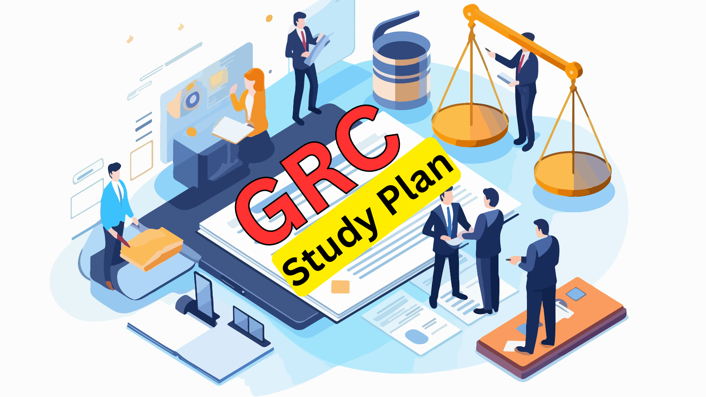

# GRC Study Plan
Here’s a detailed study plan for GRC (Governance, Risk, and Compliance) professionals and beginners:


## Introduction into GRC
GRC is an initialism that denotes Governance, Risk, and Compliance, but the reality is much more. GRC is the integrated collection of capabilities that enable an organization to reliably achieve objectives, address uncertainty, and act with integrity.

### GRC Overview
- **Governance:** The framework and processes that ensure an organization’s strategies, objectives, and risks are managed and aligned with its goals. It includes policies, procedures, and decision-making structures.
- **Risk Management:** Identifying, assessing, and mitigating risks that could impact the organization’s ability to achieve its objectives. This involves risk assessment, risk control, and risk monitoring.
- **Compliance:** Ensuring that the organization adheres to laws, regulations, standards, and internal policies. It involves compliance audits, monitoring, and reporting.

### Key Components:
- **Governance Frameworks:** COSO, COBIT
- **Risk Management Frameworks:** ISO 31000, NIST SP 800-30, NIST RMF
- **Compliance Frameworks:** GDPR, HIPAA, SOX, ISO27K1, SOC

### Why GRC
- Governance & Oversight provides methods to guide, constrain and conscribe the organization to achieve its purpose, mission, vision, and values.
- Strategy & Performance provides methods to guide, arrange and operate resources to achieve objectives and monitor performance.
- Risk & Decision-Support provides methods to identify and address the eect of uncertainty on objectives, including ways to support decisions under uncertainty.
- Compliance & Ethics provides methods to identify and address mandatory and voluntary obligations and the underlying ethical principles and values.
- Security & Continuity provides methods to identify and address threats to critical physical and digital assets and infrastructure.
- Audit & Assurance provides methods to enhance confidence that the organization is reliably achieving objectives, addressing uncertainty, and acting with integrity.

But for the scope of this study plan we will focus on the following elements:
- Governance & Oversight
- Risk & Decision-Support
- Security & Continuity
- Audit & Assurance

## Duration for Learning GRC Fundamentals
### Beginners
- **Basic Understanding (4-6 weeks):** This includes foundational concepts, terminology, and an overview of GRC frameworks.
- **Intermediate Knowledge (8-12 weeks):** In-depth study of governance, risk management, and compliance processes, and their application in real-world scenarios.

### Advanced Professionals
- **Refinement and Specialization (6-8 weeks):** Advanced topics, integration of GRC systems, and case studies on complex GRC challenges.

## Concepts Required to Excel in the GRC Domain
### Governance
- **Strategic Planning:** Understanding organizational goals and aligning GRC efforts.
- **Policy Development:** Crafting policies that support governance and compliance.
- **Internal Controls:** Designing and implementing controls to mitigate risks.

### Risk Management
- **Risk Assessment:** Techniques for identifying and evaluating risks.
- **Risk Mitigation:** Strategies for controlling and reducing risk impact.
- **Incident Management:** Processes for handling and recovering from risk events.

### Compliance
- **Regulatory Knowledge:** Understanding of relevant laws and regulations.
- **Compliance Auditing:** Techniques for auditing and ensuring compliance.
- **Reporting and Documentation:** Skills for documenting and reporting compliance status.

### Integration and Technology
- **GRC Software:** Familiarity with GRC tools and software (e.g., RSA Archer, MetricStream).
- **Data Analytics:** Using data to support risk assessments and compliance reporting.

### Soft Skills
- **Communication:** Effectively communicating GRC issues and strategies to stakeholders.
- **Problem-Solving:** Addressing complex GRC challenges with creative solutions.

### GRC Roles & / Jobs
> [!NOTE]
> Career Path Progression: Many professionals in GRC start in entry-level roles, such as GRC analysts or compliance officers, and then progress to more senior positions like GRC program managers, IT risk and compliance managers, or chief risk officers as they gain experience and certifications. Senior-level roles often require deep expertise in both the business and regulatory landscapes, as well as leadership and strategic planning abilities.

In the field of Governance, Risk, and Compliance (GRC), there are a variety of roles that span different responsibilities and levels of expertise. These roles focus on ensuring that organizations adhere to regulatory standards, effectively manage risks, and maintain strong governance practices. Below is a breakdown of the different jobs and roles in GRC:

1. GRC Analyst
- Responsibilities:
  - Conduct risk assessments and analyze data to identify risks and compliance gaps.
  - Monitor and report on governance, risk, and compliance activities. 
  - Assist in implementing GRC tools and technologies. 
  - Draft and update policies and procedures to ensure regulatory compliance.
- Skills Required:
  - Strong analytical and communication skills. 
  - Knowledge of risk management frameworks (ISO 31000, NIST). 
  - Understanding of relevant regulations (GDPR, HIPAA, SOX). 
- Typical Employers: Banks, financial institutions, large enterprises, IT firms.
2. Risk Management Specialist
- Responsibilities:
  - Identify, assess, and monitor risks across different areas of the organization. 
  - Develop and implement risk mitigation strategies. 
  - Conduct regular risk assessments and create risk reports for senior management. 
  - Work with business units to integrate risk management into operations.
- Skills Required:
  - Proficiency in risk management frameworks (COSO, ISO 31000). 
  - Strong problem-solving and analytical abilities. 
  - Risk modeling and analysis experience. 
- Typical Employers: Insurance companies, financial institutions, consulting firms.
3. Compliance Officer
- Responsibilities:
  - Ensure the organization adheres to relevant laws, regulations, and internal policies. 
  - Conduct compliance audits and report on compliance risks. 
  - Stay updated on changes in regulatory requirements and ensure the organization adjusts accordingly. 
  - Train employees on compliance policies and procedures.
- Skills Required:
  - Knowledge of industry-specific regulations (e.g., HIPAA, SOX, GDPR). 
  - Strong attention to detail and analytical skills. 
  - Audit and regulatory experience.
- Typical Employers: Healthcare, banking, tech firms, regulated industries.
4. GRC Consultant
- Responsibilities:
  - Provide advisory services to clients on GRC frameworks, policies, and procedures. 
  - Conduct audits and assessments for governance, risk, and compliance. 
  - Design and implement GRC programs and tools for clients. 
  - Train and educate client teams on GRC best practices.
- Skills Required:
  - In-depth knowledge of multiple GRC frameworks and standards.
  - Strong communication and client management skills. 
  - Ability to tailor GRC solutions to specific industries. 
- Typical Employers: Consulting firms (Big Four: Deloitte, PwC, EY, KPMG).
5. Internal Auditor
- Responsibilities:
  - Conduct internal audits to ensure compliance with policies, regulations, and internal controls. 
  - Evaluate the effectiveness of risk management and governance processes. 
  - Report audit findings to management and suggest improvements. 
  - Monitor remediation efforts and follow up on recommendations.
- Skills Required:
  - Experience with auditing standards (IIA, ISO 19011). 
  - Detail-oriented with strong analytical skills. 
  - Knowledge of risk management and internal control frameworks. 
- Typical Employers: Large corporations, government organizations, public institutions.
6. GRC Program Manager
- Responsibilities:
  - Oversee the design and implementation of the GRC program across the organization. 
  - Ensure integration of GRC activities with overall business strategies. 
  - Lead cross-functional teams in managing governance, risk, and compliance initiatives. 
  - Track GRC program performance metrics and report to senior leadership.
- Skills Required:
  - Project management experience (PMP, PRINCE2). 
  - Deep understanding of GRC processes and tools. 
  - Strong leadership and communication skills.
- Typical Employers: Large enterprises, multinational corporations, consulting firms.
7. IT Risk and Compliance Manager
- Responsibilities:
  - Manage IT-related risks and ensure compliance with information security standards. 
  - Oversee IT audits and risk assessments. 
  - Ensure compliance with IT-specific regulations like GDPR, PCI DSS, and SOX. 
  - Implement and monitor IT governance frameworks such as COBIT and NIST.
- Skills Required:
  - Strong knowledge of information security, IT governance, and regulatory requirements. 
  - Certifications such as CISM, CRISC, or CISSP. 
  - Experience with IT risk assessment and mitigation.
- Typical Employers: Technology companies, financial institutions, healthcare providers.
8. Chief Risk Officer (CRO)
- Responsibilities:
  - Develop and lead the organization’s risk management strategy and framework. 
  - Oversee enterprise risk management, internal audits, and compliance activities. 
  - Report to the board of directors on risk exposure and mitigation efforts. 
  - Drive risk culture and awareness throughout the organization.
- Skills Required:
  - Strong leadership and strategic planning abilities. 
  - Advanced knowledge of risk management and governance frameworks. 
  - Experience working at the executive level.
- Typical Employers: Large enterprises, multinational corporations, regulated industries.
9. Chief Compliance Officer (CCO)
- Responsibilities:
  - Develop and oversee the organization’s compliance program. 
  - Ensure that the organization complies with all external regulations and internal policies. 
  - Lead compliance audits and investigations. 
  - Serve as the key point of contact for regulatory agencies.
- Skills Required:
  - Deep understanding of regulatory requirements in the organization’s industry. 
  - Strong communication and decision-making abilities. 
  - Experience with legal and compliance frameworks. 
- Typical Employers: Banks, healthcare organizations, multinational companies.
10. Enterprise Risk Manager
- Responsibilities:
  - Manage enterprise-wide risk, ensuring a unified approach to risk across all business units. 
  - Implement risk management strategies at the organizational level. 
  - Ensure compliance with risk management standards like ISO 31000. 
  - Present risk reports and mitigation strategies to senior leadership.
- Skills Required:
  - Proficiency in enterprise risk management frameworks (ERM). 
  - Ability to work with cross-functional teams and lead risk management initiatives. 
  - Excellent analytical and problem-solving skills. 
- Typical Employers: Large corporations, public sector, consulting firms.
11. GRC Software Specialist/Administrator
- Responsibilities:
  - Manage the organization’s GRC software platform (e.g., RSA Archer, MetricStream). 
  - Configure and customize GRC tools to support governance, risk, and compliance activities. 
  - Train staff on the use of GRC technology. 
  - Ensure data integrity and proper reporting from the GRC platform.
- Skills Required:
  - Technical expertise in GRC software. 
  - Familiarity with governance, risk, and compliance processes. 
  - Strong project management and troubleshooting skills. 
- Typical Employers: Large corporations, IT service providers, financial institutions.

### The 101 on "GRC"
>  The easy way of understanding GRC: 

```
#### G = People
  - People are the ones who commit misconduct and make mistakes and miscalculations.

#### R = Wicked Problems; Complex Adaptive Sytem of Systems
  - Wicked Problems - describe a complex, dynamic, and multifaceted problem that is
    difficult or even impossible to solve completely. 
  - Complex adaptive system of systems - is a type of system that is made up of many
    interacting subsystems, each with its own behavior, rules, and feedback loops.

#### C = Fractality
  - Fractality refers to the property of self-similarity or the repetition of patterns
    at different scales in a system or structure.
```

### GRC Model
A GRC model refers to the structured approach an organization adopts to integrate governance, risk management, and compliance into its operations. The goal of the model is to ensure all three elements (Governance, Risk, and Compliance) work together efficiently and align with the organization’s overall strategy and objectives. There are several well-established models/frameworks used in GRC:

#### The Three Lines of Defense Model:
- **First Line:** Operational management owns and manages risks. They are responsible for identifying, assessing, and controlling risks in day-to-day operations.
- **Second Line:** Risk management and compliance functions provide oversight. They develop policies and monitor their application.
- **Third Line:** Internal audit provides independent assurance by reviewing the effectiveness of the governance and risk management framework.

#### COSO (Committee of Sponsoring Organizations) Framework:
- Focuses on internal controls, risk management, and corporate governance.
- It outlines five key components:
  - Control Environment, 
  - Risk Assessment, 
  - Control Activities, 
  - Information and Communication, and 
  - Monitoring.

#### COBIT (Control Objectives for Information and Related Technologies):

A framework for the governance and management of IT enterprise systems.
Helps ensure alignment between IT and business goals, manage risk, and ensure compliance.
Unified GRC Model:

This model integrates GRC activities across the organization into a cohesive framework, where governance, risk management, and compliance are addressed in a unified manner.
It avoids silos by aligning risk management, compliance functions, and governance under a single operational structure, often supported by technology platforms for GRC automation.

#### Key Aspects of a GRC Model:
- Integration: GRC activities (governance, risk, and compliance) should be integrated across departments and not handled in isolation.
- Accountability: Clear roles and responsibilities should be defined for those managing governance, risk, and compliance.
- Process Alignment: Risk management and compliance activities should align with organizational governance processes and strategic objectives.
- Technology Enablement: Use of GRC tools to manage policies, track risks, and ensure compliance can significantly enhance efficiency.

### Measuring GRC
Measuring the effectiveness of a GRC program involves establishing metrics that assess how well the governance, risk, and compliance functions are performing. These measurements provide insight into whether the GRC model is helping the organization achieve its goals while managing risks and adhering to regulatory requirements.

#### Key Metrics for Measuring GRC:
**Governance Metrics:**
* Policy Adherence Rate: Measures how well employees and processes comply with internal policies.
* Decision-Making Efficiency: Evaluates the effectiveness and timeliness of decisions made based on governance frameworks.
* Stakeholder Engagement: Surveys and feedback from stakeholders to measure their involvement in governance.

**Risk Management Metrics:**
* Risk Identification Rate: Measures how frequently new risks are identified, indicating proactive risk management.
* Risk Mitigation Success: Assesses how effective the organization is in addressing identified risks (i.e., reduction in the number of incidents).
* Risk Appetite Adherence: Evaluates how well the organization operates within its defined risk appetite or tolerance.

**Compliance Metrics:**
* Compliance Breach Rate: The number of compliance violations or regulatory breaches.
* Audit Findings: The number and severity of issues identified during audits, particularly regarding compliance with internal or external regulations.
* Compliance Training Completion Rate: The percentage of employees who have completed required compliance training.

**Incident Response and Recovery Metrics:**
* Mean Time to Detect (MTTD): Measures the average time it takes to detect a security or compliance incident.
* Mean Time to Respond (MTTR): Tracks how quickly an organization can respond to and mitigate an incident.
* Incident Recurrence Rate: Measures whether the same or similar incidents are occurring repeatedly, indicating the effectiveness of risk controls.

**GRC Program Efficiency:**
* Cost of Compliance vs. Non-Compliance: Compares the cost of implementing and maintaining compliance with the financial impact of non-compliance (penalties, fines, etc.).
* GRC Integration Efficiency: Evaluates how well governance, risk management, and compliance processes are integrated into business operations.
* Technology Utilization: Measures the degree to which GRC technologies are used effectively to automate processes, streamline reporting, and reduce manual effort.

**Overall Performance Metrics:**
* ROI on GRC Investments: This metric evaluates the return on investment (ROI) for GRC initiatives, comparing costs against measurable benefits, such as reduced incidents, improved compliance, and more effective risk management.
* Risk Exposure Reduction: Measures the overall reduction in risk exposure across different categories (operational, financial, legal) as a result of GRC activities.
* Audit Results: Successful internal or external audit outcomes indicate strong GRC processes.

### Certification
**For Beginners:**
- **Certified in Risk and Information Systems Control (CRISC):** Focuses on risk management.
- **Certified Information Systems Auditor (CISA):** Covers auditing, control, and assurance.

**For Intermediate/Advanced Professionals:**
- **Certified Information Systems Security Professional (CISSP):** Provides a broad understanding of security principles, including governance and risk management.
- **Certified in Governance, Risk, and Compliance (CGRC):** Specialized certification for GRC professionals.

**For Expert Level:**
- **Certified in Risk Management Assurance (CRMA):** Focuses on risk management and assurance.
- **Certified Information Security Manager (CISM):** Focuses on information security management, including governance and risk management.

## Resources
### Books
- *“Governance, Risk, and Compliance Handbook for Financial Services”* by J. J. Stone
- *“Managing Risk in Information Systems”* by D. G. Peltier
- *“The Complete Guide to Cybersecurity Risks and Controls”* by Anne Kohnke, et al.

### Videos/Tutorials
- **YouTube Channels:** GRC-related content can be found on channels like “InfoSec Institute,” “Cybrary,” and “SANS Institute.”
- [Practical GRC Series: Part 1 by Prabh Nair](https://www.youtube.com/watch?v=mq_vSLHm4r0)
- [Practical GRC Series: Part 2 by Prabh Nair](https://www.youtube.com/watch?v=Zfq3eJNvZdY)

### Online Platforms
- **LinkedIn Learning:** Offers courses on risk management, governance, and compliance.
- **Pluralsight:** Provides courses on GRC concepts and frameworks.
- **Coursera/Udemy/Udacity/EdX:** Look for courses on GRC fundamentals, risk management, and compliance.

### Communities
- **ISACA:** Offers resources, forums, and events for GRC professionals.
- **GRC Summit:** An annual event where professionals can network and learn about the latest in GRC.
- **ISC2 Community:** An active group where professionals help each other through various ways including meetup, training, guidance, job referrals etc.

### Useful Links
- [You will get what you need for ISO 27001 here](https://www.iso27001security.com/)
- [NIST RMF](https://nvlpubs.nist.gov/nistpubs/SpecialPublications/NIST.SP.800-37r2.pdf)


