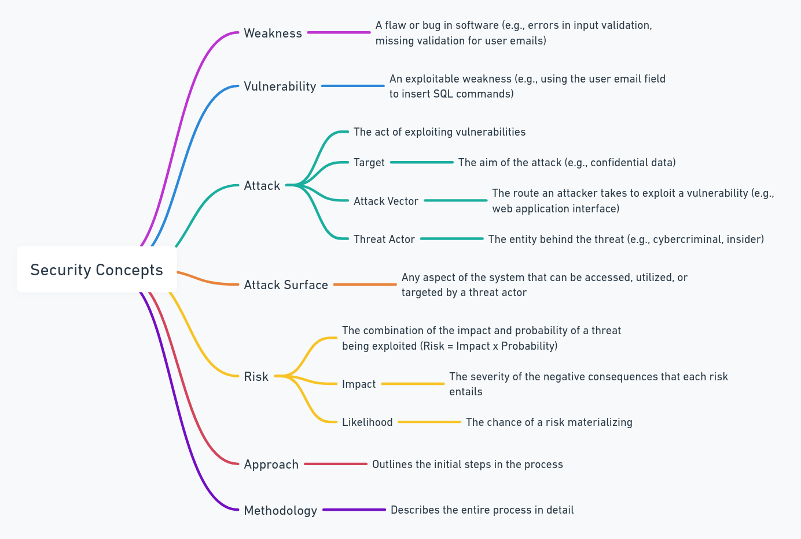
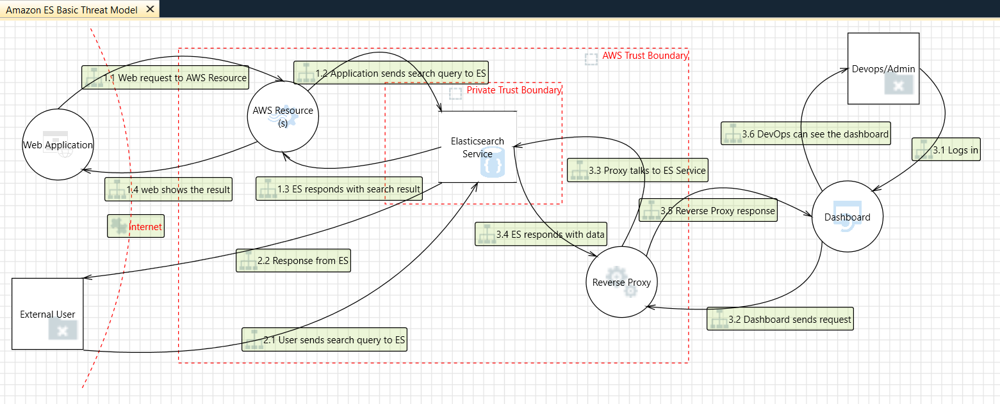

## Threat Modelling
> [!IMPORTANT]
> If you are into Product security or application security or security engineering, you would need this study plan more than any other security professionals. However, it is advised for every security professional to have a fair understanding of Threat Modeling fundamentals.

> [!Note]
> It should take 1-2 months for good understanding of Threat Modeling with some hands-on experiences.

### What is Threat Modeling
Threat modelling is a structured approach for analysing the security of an application and enables to identify, quantify, and address the security risks associated with an application.
From details about threats and likely attacks against each application, the organization operates more effectively through better decisions about prioritization of initiatives for security. 
Additionally, decisions for risk acceptance are more informed, therefore better aligned to the business.

You must go through [OWASP Threat Modeling Cheat Sheet](https://cheatsheetseries.owasp.org/cheatsheets/Threat_Modeling_Cheat_Sheet.html) for basic understanding.

In short,
- **Threat modeling is the process** of identifying, analyzing, and mitigating potential security threats to a system or organization. 
- It involves identifying the assets that need to be protected, analyzing the potential threats to those assets, and developing strategies to mitigate or eliminate those threats.
- The early you perform Threat Modeling the better result you would get.

### The objective to conduct threat modelling is to investigate following:
1. The trust boundaries to and within the application
2. The actors that interact within and outside of the trust boundaries
3. Information flows within and to and from the trust boundaries
4. Information persistence within and out of trust boundaries
5. Threats to transgression of trust boundaries by actors and for information flow and persistence
6. Vulnerabilities at trust boundaries as accessed by actors and for information flow and persistence
7. Threat agents that can exploit the vulnerabilities
8. Impact of exploitation of vulnerability by a threat agent
9. Decision tree to treat the risk

## Threat Modeling Concepts & Terms

### Why Threat Modeling? :point_up:
As benefits of threat modeling, we can say:
+ **Proactive Threat Identification:** Early detection of possible security problems.
+ **Cost Efficiency:** Addressing threats early lowers remediation expenses.
+ **Prioritization:** Concentration on the most significant vulnerabilities.
+ **System Understanding:** Enhanced insight into system interactions and data flows.

### VAPT vs Threat Modeling
- While both threat modeling and VAPT are important tools for ensuring the security of a system or organization, they are used for different purposes and at different stages of the development process. 
- Threat modeling is typically done as a proactive measure, while VAPT is done as a reactive measure. 
- Some organizations may choose to use both approaches as part of a comprehensive security program.
- Threat Model helps developers, pentesters and others to narrow down the scope and yields a better code or pentest outcome.

#### Key Outputs:
+ **System Diagrams:** Comprehensive illustrations of the architecture and data flows.
+ **Security Requirements:** Defined criteria for protecting the system.
+ **Threat List:** Inventory of potential threats along with mitigation strategies.

## Here are some areas that are typically covered in threat modeling:
### Assets: 
The first step in threat modeling is to identify the assets that need to be protected. These assets can include data, hardware, software, and people.

### Threats: 
The next step is to identify the potential threats to the identified assets. This can be done through a variety of methods, such as brainstorming sessions, reviewing industry reports and research, and consulting with subject matter experts.

### Likelihood and impact: 
Once potential threats have been identified, the next step is to assess the likelihood and impact of each threat. This helps prioritize the threats and determine which ones need to be addressed first.

### Mitigation strategies: 
Based on the likelihood and impact of the identified threats, develop strategies to mitigate or eliminate those threats. These strategies can include implementing technical controls, such as firewalls and intrusion detection systems, as well as non-technical controls, such as security awareness training and incident response plans.

### Testing and validation: 
After the threat mitigation strategies have been implemented, it is important to test and validate their effectiveness to ensure that they are effective in mitigating or eliminating the identified threats.

### Review and update: 
Threat models should be reviewed and updated on a regular basis to ensure that they remain current and relevant. This includes identifying new threats, reassessing the likelihood and impact of existing threats, and updating the threat mitigation strategies as needed.

## To perform threat modeling, follow these steps:
1. **Define the scope of the threat modeling study:** 
This includes identifying the system or organization that needs to be protected and the assets that need to be considered in the threat modeling process.
2. **Identify potential threats:** 
This involves identifying potential threats to the assets identified in step 1. This can be done through a variety of methods, such as brainstorming sessions, reviewing industry reports and research, and consulting with subject matter experts.
3. **Analyze the likelihood and impact of identified threats:** 
Once potential threats have been identified, the next step is to assess the likelihood and impact of each threat. This helps prioritize the threats and determine which ones need to be addressed first.
4. **Develop strategies to mitigate or eliminate identified threats:** 
Based on the likelihood and impact of the identified threats, develop strategies to mitigate or eliminate those threats. These strategies can include implementing technical controls, such as firewalls and intrusion detection systems, as well as non-technical controls, such as security awareness training and incident response plans.
5. **Test and validate the effectiveness of the threat mitigation strategies:** 
After the threat mitigation strategies have been implemented, it is important to test and validate their effectiveness to ensure that they are effective in mitigating or eliminating the identified threats.
6. **Review and update the threat model:** 
Threat models should be reviewed and updated on a regular basis to ensure that they remain current and relevant. This includes identifying new threats, reassessing the likelihood and impact of existing threats, and updating the threat mitigation strategies as needed.

> [!TIP]
> Try to practice to build threat model diagram as much as possible. Like make a threat model diagram for a person website, wordpress site hosted in AWS, an application using API and third-party integration

### Threat Model Diagram basics for Amazon Elasticsearch as an example :tada: :

Try to understand the diagram as much as possible and practice to make something like this on your own. This diagram might need update or modification. The more your practice the easier it would be for you.

### Resources
1. https://owasp.org/www-project-threat-dragon/
2. https://owasp.org/www-community/Threat_Modeling
3. https://www.simplilearn.com/what-is-threat-modeling-article
4. https://www.synopsys.com/glossary/what-is-threat-modeling.html
5. https://www.eccouncil.org/threat-modeling/
6. https://komsr3ll.medium.com/threat-modelling-attack-vectors-4f4989336588
7. https://www.oreilly.com/library/view/hands-on-red-team/9781788995238/55d89c3e-e3f2-414a-872f-37620e9ab43f.xhtml
8. https://www.mitre.org/sites/default/files/2021-11/prs-18-1174-ngci-cyber-threat-modeling.pdf
9. https://redcanary.com/blog/threat-modeling/
10. https://www.jemurai.com/2020/11/10/risk-and-threat-modeling-with-mind-maps/
11. https://shellsharks.com/threat-modeling
12. [Clone this repo for more resources: Awesome Threat Modeling by @secfigo](https://github.com/hysnsec/awesome-threat-modelling)
13. [Threat Modeling Podcast by Chris Romeo](https://open.spotify.com/show/4q9BxNrRb0NWnLBpSmNqoP)
14. [Threat Modeling learning resources: Linkedin Post](https://www.linkedin.com/feed/update/urn:li:activity:7209798162687873026/)

### Video Resources :bulb:
1. https://youtu.be/h_BC6QMWDbA
2. https://youtu.be/GqmQg-cszw4
3. https://youtu.be/fggB70PxhmA
4. https://youtu.be/lnvYlg4HOX4
5. https://youtu.be/GuhIefIGeuA
6. https://youtu.be/CjzdC0Eerfw
7. [Paid Course on Udemy: Threat Modeling using STRIDE by Taimur](https://www.udemy.com/course/threat-modeling-using-stride-masterclass/?couponCode=IND21PM)

### Books :books:
1. [Threat Modeling: Design for Security by Adam Shostack](https://amzn.to/3zfKefb)
2. [Threat Modeling by Izar Tarandach](https://amzn.to/4gEgbif)